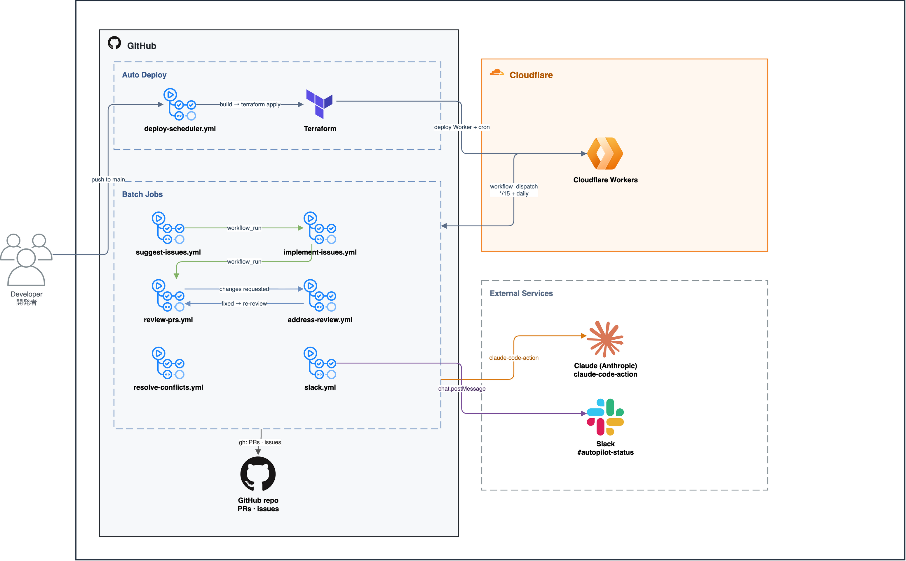

# autopilot

Life-automation batches: scheduled / manual GitHub Actions that run
[Claude Code Action](https://github.com/anthropics/claude-code-action)

## Batches

| Workflow | What it does | Trigger |
| --- | --- | --- |
| [resolve-conflicts](.github/workflows/resolve-conflicts.yml) | Auto-resolve merge conflicts on your open PRs | every 15m (Cloudflare) + manual |
| [suggest-issues](.github/workflows/suggest-issues.yml) | Review your starred-own repos; open improvement/bug issues | daily 03:00 JST (Cloudflare) + manual |
| [implement-issues](.github/workflows/implement-issues.yml) | Implement open issues as draft PRs | after suggest-issues + manual |
| [review-prs](.github/workflows/review-prs.yml) | Review your open PRs for correctness; record an approve / changes-requested verdict on each | after implement-issues / address-review + every 15m (Cloudflare) + manual |
| [address-review](.github/workflows/address-review.yml) | Read changes-requested verdicts and push fixes to the PR's head branch (the "redo" worker) | after review-prs + every 15m (Cloudflare) + manual |
| [slack](.github/workflows/slack.yml) | Post/update the single Slack status board (#autopilot-status) with each workflow's last run and next scheduled run | every 15m (Cloudflare) + on workflow_run + manual |
| [usage-report](.github/workflows/usage-report.yml) | Post a daily Claude usage/cost digest (#autopilot-reports) | daily 03:00 JST (Cloudflare) + manual |

The **review-prs ⇄ address-review** loop is bounded: `review-prs` records a verdict in a
machine-readable marker comment on the PR, `address-review` fixes and pushes (moving the head
SHA), and the next `review-prs` run re-reviews. It converges when the review approves (the
draft PR is marked ready for you) or stops after `max_rounds` rounds (default 3), after which a
still-failing PR is left for you. The review **never approves a PR whose CI checks are red**
(and defers while checks are still running), so CI failures loop back through `address-review`
rather than reaching you. GitHub forbids formally approving your own PRs, so the verdict lives in
the comment marker — not a GitHub "review" — and drives the automation.

## Scheduling

The timed triggers run on **Cloudflare Workers Cron Triggers**, not GitHub's
`schedule:` cron — GitHub's scheduler is best-effort and drops most `*/15` ticks
(≈1 run/hour). A small Worker dispatches these workflows on time via the
`workflow_dispatch` API; execution stays on GitHub Actions. It's deployed with
Terraform — see [`infra/`](infra/README.md). The `workflow_run` chains and manual
runs are unaffected.

## Setup

1. Install the [Claude GitHub App](https://github.com/apps/claude) on this repo.
2. Add two secrets under **Settings → Secrets and variables → Actions**:

   | Secret | Purpose |
   | --- | --- |
   | `CLAUDE_CODE_OAUTH_TOKEN` | Claude Max token — generate with `claude setup-token` (valid ~1 year). |
   | `GH_TOKEN` | PAT with `repo` + `workflow` scope (cross-repo read / clone / push / PR / issue). |

`claude setup-token` needs Claude Code locally — `nix develop` provides `claude-code`, `git`, `gh`, `jq`, `terraform`.

## Cost & usage monitoring

GitHub Actions is free (public repo); model usage draws on your Claude Max limits with no
monetary overage by default. Per-run caps (`--max-turns`, `max_issues`, `timeout-minutes`) and
the model choice live in each workflow's `claude_args`.

Every Claude run is metered: the [`record-usage`](.github/actions/record-usage) composite action
(one step after each `claude-code-action`) parses the run's `execution_file` — token counts plus an
API-equivalent cost estimate and per-model breakdown — and appends one record to the **`usage-ledger`**
branch. Two surfaces consume it, deliberately split (report vs alert):

- **Reports** (quiet, scheduled) — [`usage-report`](.github/workflows/usage-report.yml) posts a daily
  digest to `#autopilot-reports`: tokens, API-equivalent cost, per-workflow and per-model breakdown,
  and weekly budget consumption. AI-free; dispatched at 03:00 JST by the Cloudflare scheduler.
- **Alerts** (loud, edge-driven) — posted to `#autopilot-alerts` only when money or a hard stop is at
  stake: a run authenticated via an **API key** (real billing risk — see claude-code#43333), a run that
  **hit the Max usage limit** (`usage limit reached`), or the self-imposed **weekly cost-equivalent
  budget** being exceeded.

> The dollar figures are a **cost-equivalent** (what the tokens would cost at API list prices), not a
> real bill — a Max subscription is not billed per token. Use them as a budget yardstick and an anomaly
> signal; the true ceiling is your Max usage limit (5h + weekly windows), which is not dollar-denominated
> and is only observed reactively (a run failing with `usage limit reached`). There is no public API for
> subscription usage, so we meter what we own (per-run tokens) and detect the ceiling on contact.

Setup — add under **Settings → Secrets and variables → Actions → Variables** (the `SLACK_BOT_TOKEN`
secret and `GH_TOKEN` PAT are reused; invite the Slack bot to both channels):

| Variable | Purpose |
| --- | --- |
| `SLACK_REPORT_CHANNEL_ID` | `#autopilot-reports` channel id (daily digest) |
| `SLACK_ALERT_CHANNEL_ID` | `#autopilot-alerts` channel id (billing / limit / budget alerts) |
| `USAGE_WEEKLY_BUDGET_USD` | optional — weekly cost-equivalent budget; enables the budget bar + budget alert |
| `USAGE_ALERT_WARN_PCT` / `USAGE_ALERT_CRIT_PCT` | optional — budget thresholds (default `80` / `100`) |

The `usage-ledger` branch is created automatically on the first metered run, or bootstrap it once:
`git switch --orphan usage-ledger && git commit --allow-empty -m "init usage ledger" && git push -u origin usage-ledger`.
